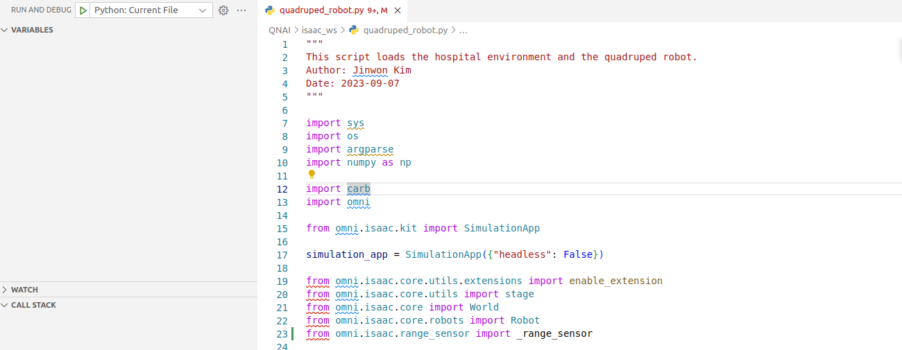

# QNAI

This project is a Framework for quadruped robot in isaac sim.

## Settings

You need to clone this project inside the folder of your Isaac Sim project.
e.g.:

```
~/.local/share/ov/pkg/isaac_sim-2022.2.1
```

Now you can easily launch the python file in the isaac_ws folder using VScode.

if you want to know more details, show the [isaac sim documentation](https://docs.omniverse.nvidia.com/isaacsim/latest/install_python.html).

## Launch python files


you can launch python file using left upper button "Python: Current File"
