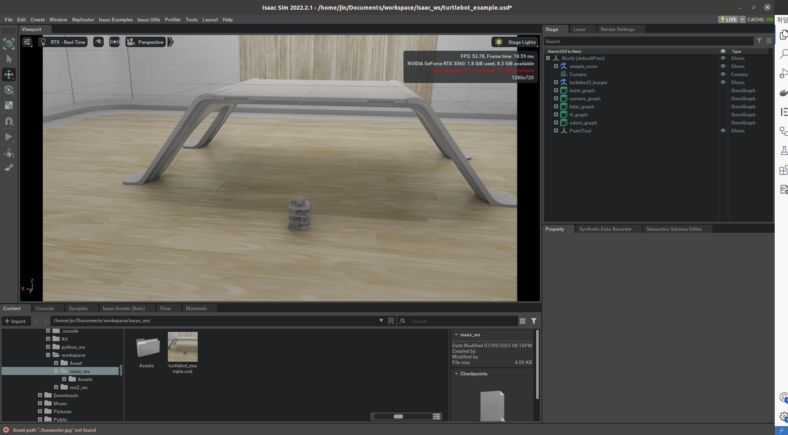
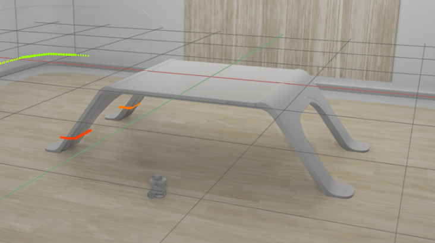

# Quadruped robot NAvigation Isaac simulator

## Table of Contents

-   [Quadruped robot NAvigation Isaac simulator](#quadruped-robot-navigation-isaac-simulator)
    -   [Table of Contents](#table-of-contents)
    -   [About ](#about-)
    -   [Getting Started ](#getting-started-)
    -   [Examples ](#examples-)
        -   [Turtlebot twist command](#turtlebot-twist-command)
        -   [Nav2 example](#nav2-example)

## About <a name = "about"></a>

This is integrated system for navigation in isaac simulator.

## Getting Started <a name = "getting_started"></a>

You need to install [Isaac sim](https://docs.omniverse.nvidia.com/isaacsim/2022.2.1/install_workstation.html) and [ROS 2](https://docs.ros.org/en/foxy/Installation/Ubuntu-Install-Debians.html).

There is [manual](https://docs.omniverse.nvidia.com/isaacsim/2022.2.1/install_ros.html) that recommend what version is well fitted.

you need to download "isaac_ws" which is asset folder for tutorial.

```bash
bash setup_usd.bash
```

This repository is tested on the **Isaac sim 2022.2.1** and **ROS 2 foxy**.

## Examples <a name = "examples"></a>

### Turtlebot twist command

1. Load the turtlebot_example.usd
   

2. Play the simulation
   

3. Publish the twist command

```
ros2 topic pub /cmd_vel geometry_msgs/Twist '{linear:  {x: 0.2, y: 0.0, z: 0.0}, angular: {x: 0.0,y: 0.0,z: 1.0}}'
```

### Nav2 example

1. Load the navigation example
   

1. Play the simulation

1. Launch navigation example

```
ros2 launch carter_navigation carter_navigation.launch.py
```
